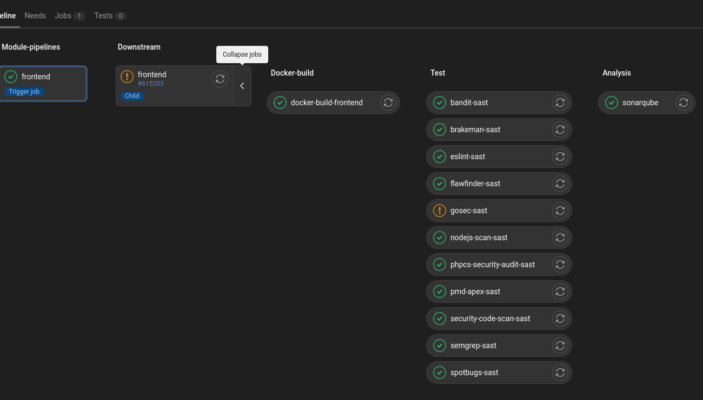

# Momo Store aka Пельменная №2

## Чеклист для проверки
- [x] Код хранится в GitLab с использованием любого git-flow
- [x] В проекте присутствует .gitlab-ci.yml, в котором описаны шаги сборки
- [x] Артефакты сборки (бинарные файлы, docker-образы или др.) публикуются в систему хранения (Nexus или аналоги)
- [x] Артефакты сборки версионируются
- [x] Написаны Dockerfile'ы для сборки Docker-образов бэкенда и фронтенда
- [x] Бэкенд: бинарный файл Go в Docker-образе
- [x] Фронтенд: HTML-страница раздаётся с Nginx
- [x] В GitLab CI описан шаг сборки и публикации артефактов
- [x] В GitLab CI описан шаг тестирования
- [] В GitLab CI описан шаг деплоя
- [x] Развёрнут Kubernetes-кластер в облаке
- [x] Kubernetes-кластер описан в виде кода, и код хранится в репозитории GitLab
- [x] Конфигурация всех необходимых ресурсов описана согласно IaC
- [] Состояние Terraform'а хранится в S3
- [] Картинки, которые использует сайт, или другие небинарные файлы, необходимые для работы, хранятся в S3
- [x] Секреты не хранятся в открытом виде
- [x] Написаны Kubernetes-манифесты для публикации приложения
- [x] Написан Helm-чарт для публикации приложения
- [x] Helm-чарты публикуются и версионируются в Nexus
- [] Приложение подключено к системам логирования и мониторинга
- [] Есть дашборд, в котором можно посмотреть логи и состояние приложения


### Устройство репозитория

```bash
.
├── backend
│   ├── cmd
│   ├── Dockerfile
│   ├── go.mod
│   ├── go.sum
│   └── internal
├── frontend
│   ├── babel.config.js
│   ├── default.conf
│   ├── dist
│   ├── Dockerfile
│   ├── nginx.conf
│   ├── node_modules
│   ├── package.json
│   ├── package-lock.json
│   ├── public
│   ├── src
│   ├── tsconfig.json
│   └── vue.config.js
├── helm-chart
│   ├── charts
│   ├── Chart.yaml
│   ├── momostore-0.1.1.tgz
│   ├── templates
│   └── values.yaml
├── kubernetes
│   ├── backend
│   ├── frontend
│   └── load-balancer.yaml
├── README.md
├── terraform
│   ├── node-group.tf
│   ├── terraform.tfstate
│   ├── terraform.tfstate.backup
│   └── yandex.tf
└── terraform.tfstate

```

### Развернуть yandex cloud k8s cluster
```bash
export YC_TOKEN=$(yc iam create-token)
export YC_CLOUD_ID=$(yc config get cloud-id)
export YC_FOLDER_ID=$(yc config get folder-id)

terraform -chdir=terraform/ init
terraform -chdir=terraform/ apply

yc managed-kubernetes cluster get-credentials <clusterid> --external --force

kubectl apply -f <directory> --recursive

```

### Деплой helm репозитория в nexus и установка на k8s cluster
```bash
helm repo add momostore https://nexus.k8s.praktikum-services.tech/repository/pavel_kozlov_momo_store --username "" --password ""
helm repo list
helm package .
curl -u "login:password" https://nexus.k8s.praktikum-services.tech/repository/pavel_kozlov_momo_store/ --upload-file momostore-0.1.1.tgz
helm install momostore momostore/momostore --version 0.1.1
helm upgrade momostore momostore/momostore --version 0.1.1

```

## Как выглядит готовый проект


## Gitlab ci


## Frontend

```bash
npm install
NODE_ENV=production VUE_APP_API_URL=http://localhost:8081 npm run serve
```

## Backend

```bash
go run ./cmd/api
go test -v ./... 
```
